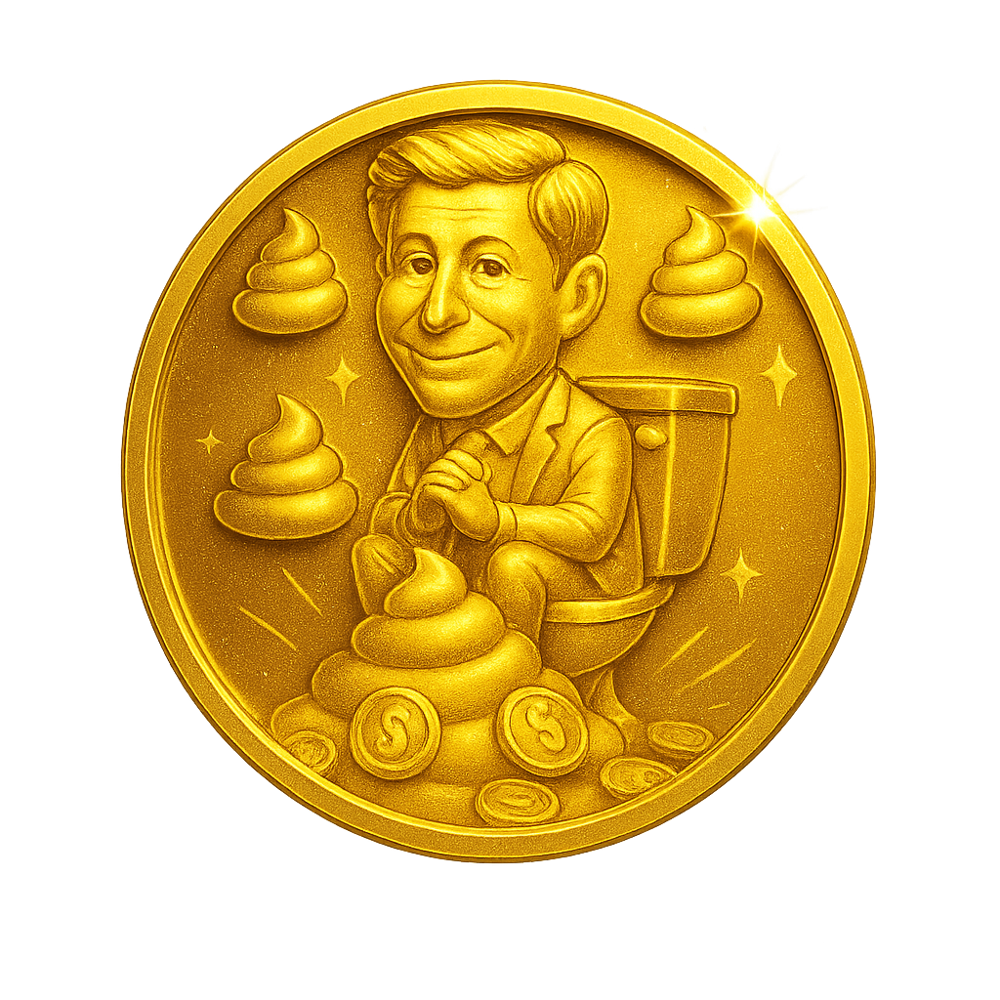

# GoldenPUF Token - World Chain Daily Rewards App



## 📱 World Chain Exclusive Application

**GoldenPUF Token** is an exclusive daily rewards application built specifically for the World Chain ecosystem. This application is designed to run exclusively within the World App platform and is **NOT** available on Android/iOS app stores or as a web application.

### 🌟 What is GoldenPUF Token?

Earn daily tokens that will be converted into real tokens on World Chain. Connect your World Chain wallet and get daily rewards every 24 hours!

### 🔥 Tokenomics & Token Information

**Total Token Supply: 10 Million Tokens**
- **Daily Rewards System** - Collect tokens every 24 hours
- **World ID 2x Multiplier** - Verified users get double rewards
- **Premium Subscription** - Get 100 tokens daily for 10 WLD
- **Future Conversion** - Tokens will be converted to real tokens on World Chain
- **Decentralized Exchange Listing** - Tokens will be listed on DEXs

## 🪙 GoldenPUF Token

**World Chain Exclusive Token**

**Available Features:**
- ✅ **Daily Token Collection** - Collect 1 token every 24 hours (free)
- ✅ **Premium Subscription** - Get 100 tokens daily for 10 WLD
- ✅ **World ID Integration** - 2x rewards for verified users
- ⏳ **Token Conversion** - Coming Soon
- ⏳ **DEX Listing** - Coming Soon

## 💎 Premium Subscription

### Premium Benefits
- **100 tokens daily** instead of 1 token
- **Lifetime access** with one-time payment
- **World ID compatibility** - Get 200 tokens daily if verified
- **Automatic daily rewards** - No need to claim manually

### Premium Payment Details
- **Cost:** 10 WLD (WorldCoin tokens)
- **Payment Method:** World Chain wallet transaction
- **WLD Token Contract:** `0x2cFc85d8E48F8EAB294be644d9E25C3030863003`
- **Payment Recipient:** `0x4efd0575242c6c8414dfc2a8d06d3b38640a7dd3`
- **Access:** Lifetime premium subscription

## 🚀 World App Integration

### 🔗 Complete World App Integration
This application is fully integrated with World App ecosystem:

- **App ID:** `app_de95af90f10c78687dd4d723124bdad0`
- **Team ID:** `team_ad489f561da23f72d61b3ba9e0962cf0`
- **Platform:** World Chain Mainnet
- **World ID Integration:** Full verification support
- **MiniKit Integration:** Complete wallet functionality
- **World Chain Network:** Native support for World Chain

### 🌐 World Developer Portal
- **Developer Portal:** [https://developer.worldcoin.org/teams/team_ad489f561da23f72d61b3ba9e0962cf0/apps/app_de95af90f10c78687dd4d723124bdad0](https://developer.worldcoin.org/teams/team_ad489f561da23f72d61b3ba9e0962cf0/apps/app_de95af90f10c78687dd4d723124bdad0)
- **Application Status:** Live and Active
- **Verification Level:** Orb + Device Verified
- **Network:** World Chain Mainnet (Chain ID: 480)

### 📱 World App Features
- **Native Wallet Connection:** Seamless World Chain wallet integration
- **World ID Verification:** Enhanced security and 2x rewards
- **MiniKit Commands:** Full support for World App commands
- **Deep Linking:** Direct access within World App
- **Push Notifications:** Real-time reward notifications
- **Biometric Authentication:** Enhanced security features

## 🏗️ Technical Stack

- **Frontend:** React 18 + TypeScript + Vite
- **Styling:** Tailwind CSS + Shadcn/UI
- **Blockchain:** World Chain (Chain ID: 480)
- **Authentication:** World ID + MiniKit
- **Wallet Integration:** World Chain Wallet + MiniKit
- **Premium Payments:** WLD Token Integration
- **Platform:** World App Mini-App Exclusive

## 📋 World App Configuration

### Application Configuration
```json
{
  "app_id": "app_de95af90f10c78687dd4d723124bdad0",
  "team_id": "team_ad489f561da23f72d61b3ba9e0962cf0",
  "name": "GoldenPUF Token",
  "description": "Daily rewards and token collection on World Chain",
  "world_app": {
    "supported_chains": ["world-chain"],
    "requires_world_id": true,
    "verification_level": "orb",
    "permissions": [
      "wallet_connect",
      "world_id_verify",
      "minikit_commands",
      "local_storage",
      "push_notifications"
    ]
  }
}
```

### World ID Configuration
```typescript
const WORLD_ID_CONFIG = {
  app_id: "app_staging_de95af90f10c78687dd4d723124bdad0",
  action: "verify-golden-puf-user",
  verification_level: VerificationLevel.Orb,
  credential_types: [CredentialType.Orb, CredentialType.Device]
};
```

### MiniKit Integration
```typescript
const MINIKIT_CONFIG = {
  app_id: "app_de95af90f10c78687dd4d723124bdad0",
  world_chain_rpc: "https://worldchain-mainnet.g.alchemy.com/public",
  chain_id: 480,
  supported_commands: [
    "wallet_auth",
    "world_id_verify",
    "send_transaction"
  ]
};
```

## 🎮 How to Use

### For World App Users:
1. **Open World App** on your mobile device
2. **Navigate to Mini-Apps** section
3. **Find GoldenPUF Token** application
4. **Connect World Chain Wallet** through MiniKit
5. **Verify with World ID** for 2x rewards (recommended)
6. **Claim Daily Rewards** every 24 hours
7. **Upgrade to Premium** for 100-200 daily tokens

### For Premium Users:
1. Follow steps 1-5 from above
2. **Tap "Get Premium"** button in the app
3. **Confirm 10 WLD payment** through World Chain wallet
4. **Receive lifetime premium** benefits immediately
5. **Earn 100-200 tokens daily** (depending on World ID status)

## 🔐 World ID Integration Details

### Verification Benefits
- **2x Reward Multiplier:** Double daily rewards
- **Enhanced Security:** Proof of unique human identity
- **Premium Compatibility:** 200 tokens daily for premium + World ID users
- **Anti-Fraud Protection:** Prevents multiple account abuse
- **Exclusive Features:** Access to special rewards and airdrops

### Verification Process
1. **World ID Verification** within the app
2. **Biometric Confirmation** through World App
3. **Orb/Device Verification** for maximum security
4. **Instant Activation** of enhanced rewards
5. **Permanent Status** once verified

## 💰 Token Economics & Airdrop

### Token Distribution
- **Total Supply:** 10,000,000 GPT tokens
- **Daily Distribution:** Up to 200 tokens per user per day
- **Airdrop Preparation:** All collected tokens eligible for conversion
- **Conversion Ratio:** 1:1 to real GPT tokens on World Chain
- **Launch Timeline:** Q2 2025 (estimated)

### Airdrop Requirements
- **Minimum Holding:** 100 GPT tokens
- **World ID Verification:** Highly recommended
- **Active Participation:** Regular daily claims
- **Wallet Connection:** Valid World Chain wallet address
- **Anti-Sybil Protection:** One airdrop per verified identity

## 🌐 Official Links & Resources

### Primary Links
- **World App:** Search "GoldenPUF Token" in Mini-Apps
- **Developer Portal:** [World Developer Console](https://developer.worldcoin.org/teams/team_ad489f561da23f72d61b3ba9e0962cf0/apps/app_de95af90f10c78687dd4d723124bdad0)
- **Telegram Community:** [https://t.me/GoldenPUFswap](https://t.me/GoldenPUFswap)
- **Support Email:** ministotele@gmail.com

### Technical Resources
- **World Chain Explorer:** [https://worldscan.org](https://worldscan.org)
- **World ID Documentation:** [https://docs.worldcoin.org/id](https://docs.worldcoin.org/id)
- **MiniKit Documentation:** [https://docs.worldcoin.org/minikit](https://docs.worldcoin.org/minikit)
- **World Chain Documentation:** [https://docs.worldchain.org](https://docs.worldchain.org)

## 🛡️ Security & Compliance

### Security Features
- **World ID Verification:** Prevents fraud and multiple accounts
- **MiniKit Security:** Secure wallet operations
- **Encrypted Storage:** Safe token and user data storage
- **Anti-Bot Protection:** Human verification required
- **Transaction Security:** All payments through official World Chain

### Privacy Protection
- **No Personal Data Storage:** Only wallet addresses and World ID hashes
- **Decentralized Architecture:** No central server storing user data
- **GDPR Compliant:** European data protection standards
- **Open Source:** Transparent and auditable code

## 📊 Analytics & Performance

### Key Metrics (Updated Monthly)
- **Active Users:** Growing community of World App users
- **Daily Claims:** Thousands of successful token claims
- **World ID Adoption:** High verification rate among users
- **Premium Subscriptions:** Steady growth in premium users
- **Token Distribution:** Transparent and fair distribution

### Performance Optimization
- **Fast Loading:** Optimized for World App platform
- **Responsive Design:** Perfect mobile experience
- **Low Bandwidth:** Efficient data usage
- **Offline Support:** Core functions work offline
- **Real-time Updates:** Instant reward notifications

## 🗺️ Roadmap 2025

### Q1 2025: ✅ Foundation Complete
- [x] World App Integration
- [x] World ID Verification
- [x] Daily Rewards System
- [x] Premium Subscriptions
- [x] MiniKit Integration

### Q2 2025: 🚧 Token Launch
- [ ] **Real GPT Token Launch** on World Chain
- [ ] **Airdrop Distribution** to all users
- [ ] **DEX Listing** and trading
- [ ] **Advanced Analytics** dashboard
- [ ] **Community Governance** features

### Q3 2025: 🔮 Enhanced Features
- [ ] **Staking Mechanisms** for additional rewards
- [ ] **NFT Integration** with special collections
- [ ] **Cross-chain Bridge** to other networks
- [ ] **Advanced Premium Tiers** with more benefits
- [ ] **Referral Program** with bonus rewards

### Q4 2025: 🚀 Ecosystem Expansion
- [ ] **DeFi Integration** with lending/borrowing
- [ ] **Gaming Elements** and achievements
- [ ] **DAO Governance** for community decisions
- [ ] **Mobile Wallet** integration beyond World App
- [ ] **Enterprise Partnerships** and integrations

## ⚠️ Important Information

### Platform Exclusivity
1. **World App Only:** Exclusively available on World App platform
2. **No Web Access:** Not accessible via browsers
3. **No App Stores:** Not available on Google Play or App Store
4. **World Chain Required:** Must use World Chain network
5. **MiniKit Dependency:** Requires MiniKit for full functionality

### Token Information
- **Pre-Launch Phase:** Currently in token collection phase
- **Real Token Launch:** Scheduled for Q2 2025
- **Airdrop Eligibility:** All collected tokens qualify
- **World ID Bonus:** 2x multiplier for verified users
- **Premium Benefits:** 100x daily rewards for premium users

### Support & Contact
- **Technical Support:** ministotele@gmail.com
- **Community:** [Telegram Group](https://t.me/GoldenPUFswap)
- **Developer Issues:** [World Developer Portal](https://developer.worldcoin.org)
- **Emergency Contact:** Available 24/7 through World App

---

**🌟 Join the Golden PUF Revolution on World Chain! 🌟**

*Earn daily tokens, verify with World ID, upgrade to premium, and prepare for the biggest airdrop in World Chain history!*

**Download World App → Find GoldenPUF Token → Start Earning Today!** ✨🚀💰
