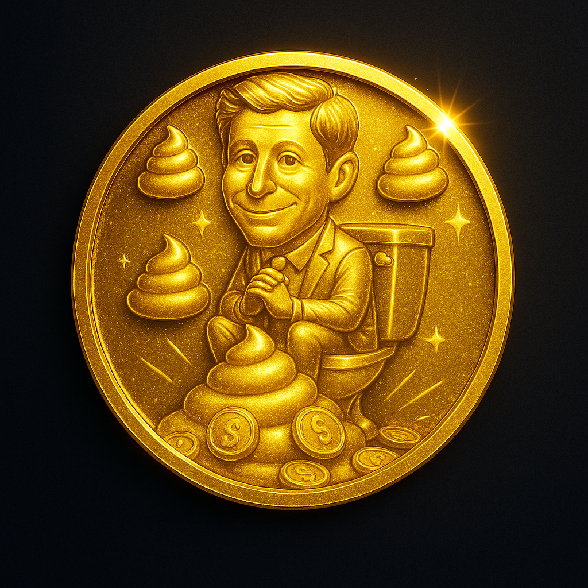

# GoldenPUF NFT - World Chain Daily Rewards App



## 📱 World Chain Exclusive Application

**GoldenPUF NFT** is an exclusive daily rewards application built specifically for the World Chain ecosystem. This application is designed to run exclusively within the World App platform and is **NOT** available on Android/iOS app stores or as a web application.

### 🌟 What is GoldenPUF NFT?

Earn daily points that will be converted into an exclusive NFT collection on World Chain. Connect your World Chain wallet and get daily rewards every 24 hours!

### 🔥 Tokenomics & Burning Mechanism

**A massive burn is planned from 100 million points:**
- **86 million points (86%) will be burned** 🔥
- **Only 14 million NFT points will remain** ✨

These points may turn into tokens or NFT collection in the future! Only 14 million in the ecosystem - keep collecting and follow project updates.

## 🪙 GoldenPUF Token ($GPUF)

**Contract Address:** `0xB7b9Bc8e8c301E761AF20143A3477e5D1890e1Dd`

**Available Features:**
- ✅ **Buy Token** - Direct integration with World Chain
- ⏳ **Staking** - Coming Soon
- ⏳ **Swap** - Coming Soon

[🔗 Buy GoldenPUF Token](https://worldcoin.org/mini-app?app_id=app_15daccf5b7d4ec9b7dbba044a8fdeab5&path=app/token/0xB7b9Bc8e8c301E761AF20143A3477e5D1890e1Dd)

## 🚀 Features

### 🎯 Core Features
- **Daily Rewards System** - Claim points every 24 hours
- **World ID Integration** - Verified users get 2x rewards
- **Point Tracking** - Secure blockchain-based point storage
- **NFT Conversion** - Points will be converted to exclusive NFTs
- **World Chain Wallet Connection** - Seamless integration

### 🛡️ Security Features
- World ID verification for enhanced rewards
- Secure point storage with multiple backup systems
- Transparent reward distribution
- Anti-fraud mechanisms

## 🏗️ Technical Stack

- **Frontend:** React 18 + TypeScript
- **Styling:** Tailwind CSS + Shadcn/UI
- **Build Tool:** Vite
- **Blockchain:** World Chain (Chain ID: 480)
- **Authentication:** World ID + World Chain Wallet
- **Charts:** TradingView Widget for live price data

## 📋 World App Integration

This application is built exclusively for the World App platform:

- **App ID:** `app_15daccf5b7d4ec9b7dbba044a8fdeab5`
- **Team ID:** `team_ad489f561da23f72d61b3ba9e0962cf0`
- **Developer App:** `app_b924910c34c036984df5a50cd6f122e9`
- **Platform:** World Chain Mainnet

### 🔗 Official Links
- [Developer Portal](https://developer.worldcoin.org/teams/team_ad489f561da23f72d61b3ba9e0962cf0/apps/app_b924910c34c036984df5a50cd6f122e9)
- [Token Purchase](https://worldcoin.org/mini-app?app_id=app_15daccf5b7d4ec9b7dbba044a8fdeab5&path=app/token/0xB7b9Bc8e8c301E761AF20143A3477e5D1890e1Dd)
- [DEX Screener](https://dexscreener.com/worldchain/0xB7b9Bc8e8c301E761AF20143A3477e5D1890e1Dd)

## 🎮 How to Use

### For Users:
1. Open the World App
2. Navigate to GoldenPUF NFT application
3. Connect your World Chain wallet
4. (Optional) Verify with World ID for 2x rewards
5. Claim daily rewards every 24 hours
6. Track your points and prepare for NFT conversion

### For Developers:
```bash
# Install dependencies
npm install

# Run development server
npm run dev

# Build for production
npm run build

# Preview production build
npm run preview
```

## 🔐 World ID Integration

The application uses World ID for enhanced security and rewards:

```typescript
const APP_ID = "app_staging_15daccf5b7d4ec9b7dbba044a8fdeab5";
const ACTION = "verify-golden-puf-user";
```

**Benefits of World ID Verification:**
- 2x daily reward multiplier
- Enhanced security
- Proof of unique human identity
- Reduced fraud risk

## 📊 Smart Contract Information

**GoldenPUF Token ($GPUF)**
- **Symbol:** GOLDENPUF-NFT
- **Name:** GoldenPUF NFT Token
- **Decimals:** 18
- **Contract:** `0xB7b9Bc8e8c301E761AF20143A3477e5D1890e1Dd`
- **Network:** World Chain Mainnet (Chain ID: 480)

## 🗺️ Roadmap

### Phase 1: ✅ Completed
- [x] Daily rewards system
- [x] World ID integration
- [x] World Chain wallet connection
- [x] Point tracking system
- [x] Token contract deployment

### Phase 2: 🚧 In Progress
- [ ] Enhanced UI/UX improvements
- [ ] Advanced analytics dashboard
- [ ] Community features

### Phase 3: 🔮 Coming Soon
- [ ] Staking mechanism
- [ ] Token swap functionality
- [ ] NFT collection launch
- [ ] Points to NFT conversion
- [ ] Advanced reward tiers

### Phase 4: 🚀 Future Plans
- [ ] Governance features
- [ ] Cross-chain bridge
- [ ] Advanced DeFi integrations

## 📈 Analytics & Monitoring

The application includes comprehensive analytics:
- Daily active users tracking
- Reward distribution monitoring
- World ID verification rates
- Point accumulation statistics

## 🛡️ Security

### Security Measures
- World ID verification integration
- Secure localStorage with multiple backups
- Anti-fraud mechanisms
- Rate limiting for reward claims
- Transparent point distribution

### Reporting Security Issues
Please report security vulnerabilities to: [security@goldenpuf.com]

## 🤝 Contributing

This project is specifically designed for World Chain ecosystem. Contributions are welcome but must maintain compatibility with World App platform.

See [CONTRIBUTING.md](./CONTRIBUTING.md) for guidelines.

## 📄 License

This project is licensed under the MIT License - see [LICENSE](./LICENSE) file for details.

## 📞 Contact & Support

- **Developer:** GoldenPUF Team
- **Email:** support@goldenpuf.com
- **World Chain Developer Portal:** [View Project](https://developer.worldcoin.org/teams/team_ad489f561da23f72d61b3ba9e0962cf0/apps/app_b924910c34c036984df5a50cd6f122e9)

## ⚠️ Important Notes

1. **Platform Exclusive:** This application runs ONLY on World App platform
2. **No Mobile Apps:** Not available on Android/iOS app stores
3. **No Web Version:** Not accessible via web browsers
4. **World Chain Only:** Designed exclusively for World Chain ecosystem
5. **Daily Claims:** Rewards are claimable every 24 hours
6. **Limited Supply:** Only 14 million points will remain after the burn

---

**Built with ❤️ for the World Chain community**

*Stay tuned for updates and the upcoming NFT collection launch!* ✨
